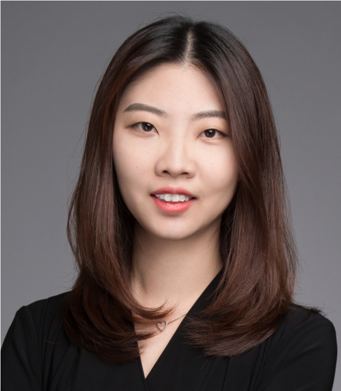

---

## Invited Speakers

<!---   

[David Lopez-Paz](http://lopezpaz.org/), Research Scientist at Meta AI Research

-->

  

### My Models Works Well… Famous Last Words.

**[Prof. Amos Storkey](https://homepages.inf.ed.ac.uk/amos/), School of Informatics, University of Edinburgh**

**Abstract:** Mark has spent the last year developing a state-of-the-art neural network for his favourite domain. But after deployment, everyone starts complaining. But surely they really should stop using it in settings that different from Mark's training scenario? Robustness matters. Any machine learning method needs to be broadly realistically applicable, must specify the domain of application, and must work across that domain. The restriction that that test environment match the training setting is neither well defined nor realistically applicable. Hence it is our responsibility to deal with domain shift, and all that entails. But why is it so hard? Why do our models break when we try to use them in the real world? Why do neural networks seem particularly susceptible to this? How do we understand and mitigate these issues? And what tools are at our disposal to build models that deal better with domain shift from the outset? We take a causal look at domain shift and look at approaches that enable improved capability when training and test domains are different.

**Bio:** Amos Storkey is Professor of Machine Learning and AI at the School of Informatics, University of Edinburgh. He leads the Bayesian and Neural Systems Research Group and is Director of the EPSRC Centre for Doctoral Training in Data Science. On the methodological side, he is known for his contributions to meta-learning and few shot learning, efficient neural network design, reinforcement learning, dataset shift, and transactional mechanisms for machine learning. His general focus is machine learning for images and video; as part of that he has a long history of developments in medical imaging and efficient methods for robust and adaptive image understanding.

  

### Open World: Generalize and Recognize Novelty

**[Assoc. Prof. Tatiana Tommasi](http://www.tatianatommasi.com), Department of Control and Computer Engineering, Politecnico di Torino; Italian Institute of Technology.**

**Bio:** Tatiana Tommasi is Associate Professor in the department of Control and Computer Engineering of Politecnico di Torino (IT), Affiliated Researcher at the Italian Institute of Technology, ELLIS scholar and director of the ELLIS Unit in Turin. She received the PhD at EPFL Lausanne (CH) in 2013 and spent post-doctoral periods in Belgium and USA before covering the role of assistant professor at Sapienza University (Rome, IT). Tatiana has published more than 50 papers at top conferences and journals in machine learning and computer vision. She has a strong record in theoretically grounded algorithms for automatic learning from images with robotics, medical and human-machine interaction applications. She pioneered the area of transfer learning in computer vision and has extensive experience in domain adaptation, generalization, multimodal and open-set learning.

  

### Towards Clinically Applicable Medical AI Systems in Open Clinical Environments.

**[Asst. Prof. Lequan Yu](https://yulequan.github.io), The University of Hong Kong.**

**Abstract:** As artificial intelligence (AI) continues to revolutionize healthcare and medical image analysis, ensuring safe and effective AI deployment in open clinical environments has become paramount. However, many existing medical AI methods prioritize model performance, focusing on achieving higher accuracy rather than clinical applicability. In this talk, I will present our works on building clinically applicable deep learning systems for medical image analysis, emphasizing domain generalization, continual learning, and multi-modality learning. Our aim is to inspire the development of more reliable and effective medical AI systems, ultimately enhancing patient care and outcomes. Additionally, I will discuss up-to-date progress and promising future directions in this critical domain.

**Bio:** Lequan Yu is an assistant professor at The University of Hong Kong. His research lies at the intersection of artificial intelligence and healthcare. I am dedicated to designing advanced machine learning algorithms for biomedical data analysis, with a primary focus on medical images, to enable reliable clinical decision making. Specifically, he focuses on: 1) developing multi-modal learning algorithms to intergrate multi-scale heterogeneous biomedical data for disease prevention, diagnosis, and prognosis; 2) building real-world learning systems to learn reliable, generalizable, and fair representations from imperfect medical data; and 3) developing causality-based learning algorithms to improve its interpretability for healthcare problems.Before joining HKU, he was a postdoctoral research fellow at Stanford University, working with Prof. Lei Xing. Lequan obtained my Ph.D. degree in CSE, The Chinese University of Hong Kong in July 2019 and the B.Eng degree in CS, Zhejiang University in 2015. 

## Panel

  

**[Asst. Prof. Zachary Lipton](https://www.zacharylipton.com), Carnegie Mellon University**

  

**[Asst. Prof. Qi Dou](https://www.cse.cuhk.edu.hk/~qdou/), Department of Computer Science and Engineering, The Chinese University of Hong Kong**

  

**[Dr. Boqing Gong](http://boqinggong.info), Google**

  

**[Prof. Amos Storkey](https://homepages.inf.ed.ac.uk/amos/), School of Informatics, University of Edinburgh**

