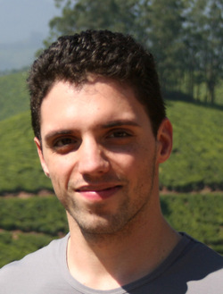

# Organizers

  

[Aniket Deshmukh](https://aniketde.github.io), Applied Scientist, Amazon

  

[Henry Gouk](https://www.henrygouk.com), RAEng Research Fellow, School of Informatics at the University of Edinburgh

  

[Timothy Hospedales](https://homepages.inf.ed.ac.uk/thospeda/), Professor, School of Informatics at the University of Edinburgh

  

[Cuiling Lan](https://www.microsoft.com/en-us/research/people/culan/), Senior Researcher, Microsoft

  

[Da Li](https://dali-dl.github.io), Senior Research Scientist, Samsung AI 

  

[Kaiyang Zhou](https://kaiyangzhou.github.io), Research Fellow, NTU Singapore
